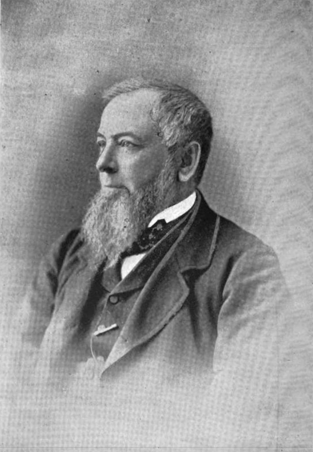

# George Armour (1812 – 1881)

* paternal great-great grandfather
*  Scottish American businessman and philanthropist

| `george-armour.png` | George Armour (1812–1881) | [Wikimedia Commons](https://commons.wikimedia.org/wiki/File:George-armour-photo-second-presbyterian-church-of-chicago.png) |

* https://www.geni.com/people/George-Armour/364407867780007569

**1812 – 1881** | Scottish American grain pioneer and art patron

Born in Campbeltown, Scotland, George Armour emigrated to America and revolutionized commodity distribution through his invention of mechanized grain elevator systems. Operating from Chicago, he was instrumental in establishing the Chicago Board of Trade's standardized grading system for grains (1858), which transformed global grain commerce. He served as president of the Chicago Board of Trade (1875–1876) and was a founder of the Merchants' Loan and Trust Company, which later became Continental Illinois. Beyond business, Armour was a passionate arts patron who served as the first president of the Chicago Academy of Fine Arts (1879), the precursor to the Art Institute of Chicago. He also founded the YMCA of Chicago and was an active elder of the Second Presbyterian Church, whose tower was donated by his family in his memory.

**Links & References:**
* <https://en.wikipedia.org/wiki/George_Armour>
* <https://www.artic.edu/> — Art Institute of Chicago (founded with Armour as first president)
* <https://www.ymcachicago.org/> — YMCA of Metro Chicago
* <https://en.wikipedia.org/wiki/George_Armour>
* <https://en.wikipedia.org/wiki/Armour,_Dole_%26_Co.>
* <http://www.encyclopedia.chicagohistory.org/pages/2555.html>
* <https://www.facebook.com/100066297863094/posts/george-armour-grain-elevator-owner-and-president-of-the-chicago-board-of-trade-b/1022691366617449/>
