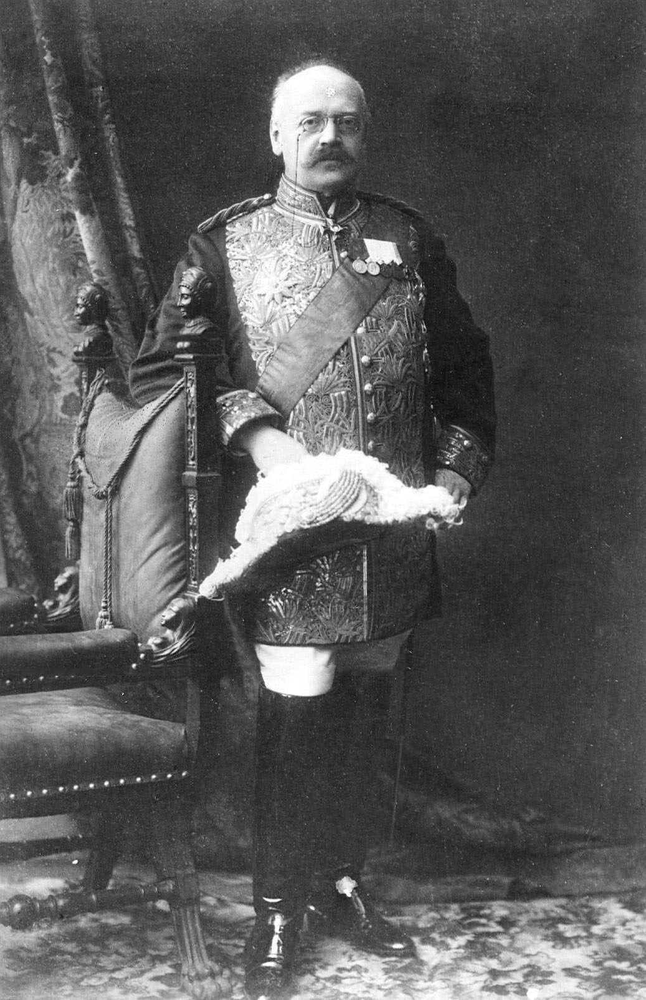

# Alexander Fyodorovich Trepov 1862-1928

| `alexander-trepov.jpg` | Alexander Trepov (1862–1928) | [Wikimedia Commons](https://commons.wikimedia.org/wiki/File:Alexander_Trepov.jpg) |

https://commons.wikimedia.org/wiki/File:Trepov.jpg

* Aleksandr Fyodorovich Trepov
* Birth:  Sep 18 1862 - Киев, Российская Империя
* Death:  Nov 10 1928 - Nice, Alpes-Maritimes, Provence-Alpes-Côte d'Azur, France
* Parents:  Fyodor Fyodorovich Sr. Trepov and Vera Vasilyevna Trepova (born Lukashevich)
* Siblings:  Anastatisya Fyodorovna, Yevgeniya Fyodorovna, Yuliya Fyodorovna, Sofya Fyodorovna, Fyodor Fyodorovich Jr., Dmitriy Fyodorovich, Dimitri Feodorovitch, Yelizaveta Fyodorovna and Vladimir Fyodorovich
* Partner:  Софья Дмитриевна Трепова (born Казина)
* Daughters:  Yelena Aleksandrovna and Sofya Aleksandrovna

* Prime Minister of the Russian Empire
* Paternal great-great-uncle

The penultimate Prime Minister of Imperial Russia (November 1916 – January 1917), Alexander Fyodorovich Trepov served during the tumultuous final months of the Romanov dynasty. He held pivotal roles as Minister of Transport and Communications, developing the strategic Kirov Railway to Murmansk during World War I. A reformer who clashed with Grigori Rasputin's influence at court, Trepov sought parliamentary reforms but was dismissed after only 50 days in office. After the October Revolution, he emigrated to France and supported the White Army, dying in exile in Nice in 1928.

**Links & References:**
* <https://en.wikipedia.org/wiki/Alexander_Trepov>
* <https://en.wikipedia.org/wiki/Kirov_Railway>
* <https://www.findagrave.com/memorial/128139665/alexander_fedorovich-trepov>
* <https://grokipedia.com/page/Alexander_Trepov >
* <https://everything.explained.today/Alexander_Trepov/ >
* <https://commons.wikimedia.org/w/index.php?search=trepov&title=Special%3AMediaSearch&type=image >