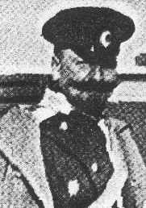

# Fyodor Maximilianovich von Nieroth 1871-1952

| `theodor-nieroth.jpeg` | Theodor von Nieroth (1871–1952) | [Wikimedia Commons](https://commons.wikimedia.org/wiki/File:Fyodor_M._Nirod.jpeg)

* https://www.geni.com/people/Count-Fyodor-von-Nieroth/6000000019324085685
* Count Fyodor Maksimilianovich von Nieroth
* Birth:  June 20 1871 - St. Petersburg, Russia
* Death:  1952 - Amblainville, Picardie, France
* Parents:  Count Maximilian Carl Benedikt von Nieroth and Anastatisya Fyodorovna Nieroth (born Trepova)
* Sister:  Vera Maksimilianovna
* Partner:  Daria Nieroth (born Fstin. Cantacuzin Gfin. Speransky)
* Children:  Mikhail Fyodorovich and Daria

**1871 – 1952** | Major General in the Imperial Russian Army

Born July 2, 1871, in Saint Petersburg into the Baltic German von Nieroth family, Theodor was the son of the courtier Maximilian von Nieroth and Anastasia Trepova — a grandson of Fyodor Trepov (senior). After graduating from the elite Page Corps in 1892, he served in a Guards cavalry regiment, was promoted to colonel in 1907, and commanded the 16th Hussar Regiment (1911) and then the Life Guards Dragoon Regiment (1912), leading the latter through the First World War. In January 1915 he was awarded the Sword of St. George for repelling an enemy cavalry brigade near Schirwindt in East Prussia, where he was wounded but stayed in the field; he went on to command the 2nd Guards Cavalry Division. During the Russian Civil War he served in Anton Denikin's White Volunteer Army before emigrating, and died in France on March 26, 1952.

Theo Armour says: "My nickname comes from my uncle Theo."

**Links & References:**
* <https://et.wikipedia.org/wiki/Theodor_von_Nieroth_(1871%E2%80%931952)> — Estonian Wikipedia
* <https://www.ra.ee/apps/georgi/html/mitte-eestlaste_elulood.html>
