# Peeps in the Armour Family

## Albert Cameron Burrage ~ Maternal great-grandfather

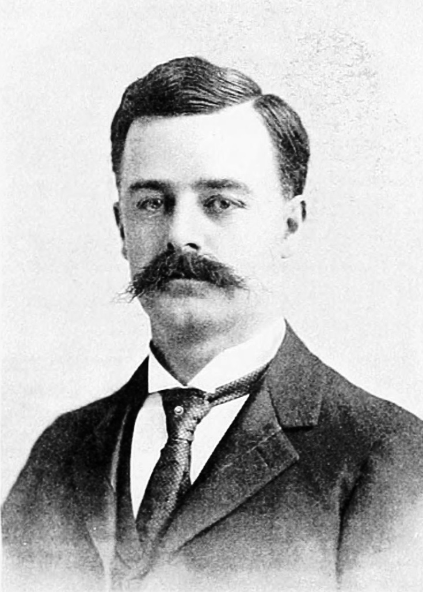

**1859 – 1931** | Industrialist, attorney, philanthropist, and orchid enthusiast

A pioneering businessman known as the "Copper King," Albert Cameron Burrage organized the Amalgamated Copper Company and founded mining operations that revolutionized low-grade copper ore processing. Beyond mining, he became renowned as a cultivator of rare orchids and served as the founding president of the American Orchid Society (1921–1929). The Royal Horticultural Society awarded him the Lindley Medal in 1925 for exceptional orchid exhibitions. His 28-room mansion on Commonwealth Avenue in Boston was built in 1899 at a cost of $600,000 and remains an architectural landmark.

**Links & References:**
* <https://en.wikipedia.org/wiki/Albert_Burrage>
* <https://www.americanorchidsociety.org/> — American Orchid Society (founded by Burrage)
* [Burrage Mansion, Redlands, CA](http://www.burragemansion.org/)

## Alexander Trepov ~ Paternal great-great-uncle

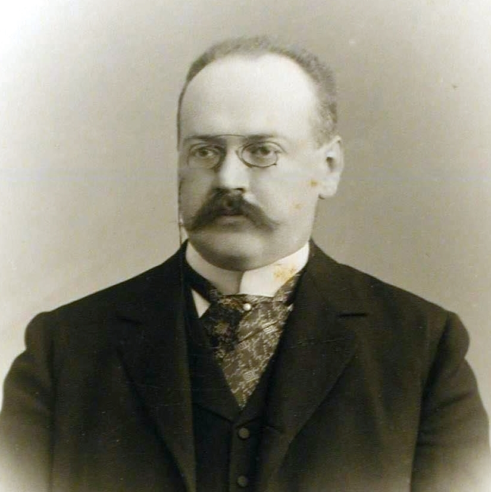

**1862 – 1928** | Prime Minister of the Russian Empire

The penultimate Prime Minister of Imperial Russia (November 1916 – January 1917), Alexander Fyodorovich Trepov served during the tumultuous final months of the Romanov dynasty. He held pivotal roles as Minister of Transport and Communications, developing the strategic Kirov Railway to Murmansk during World War I. A reformer who clashed with Grigori Rasputin's influence at court, Trepov sought parliamentary reforms but was dismissed after only 50 days in office. After the October Revolution, he emigrated to France and supported the White Army, dying in exile in Nice in 1928.

**Links & References:**
* <https://en.wikipedia.org/wiki/Alexander_Trepov>
* <https://en.wikipedia.org/wiki/Kirov_Railway>

## Allison Vincent Armour ~ Paternal great-great-uncle

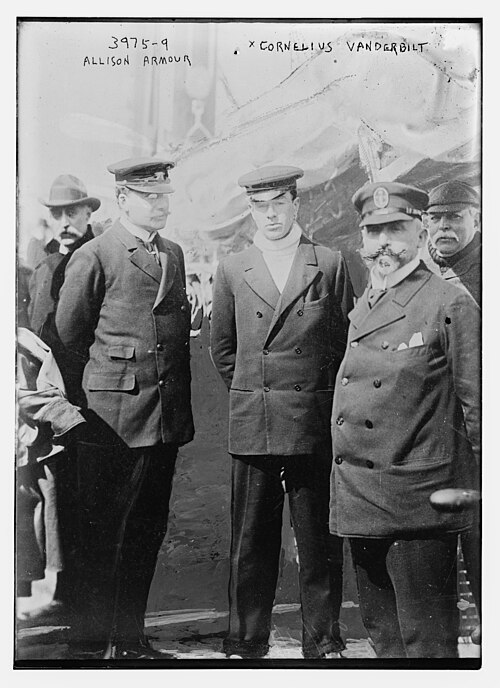

**circa 1851 – 1940** | Scientific explorer and Olympic leader

A pioneering naturalist and explorer, Allison Vincent Armour conducted fifteen major scientific expeditions for the United States Department of Agriculture, advancing American agricultural knowledge. He served as a board member of the Olympic Committee from 1908–1914, helping to establish the Olympic Games' institutional structure in America. His contributions bridged scientific exploration and international athletic governance.

**Links & References:**
* [Yale University Obituary Record](http://mssa.library.yale.edu/obituary_record/1925_1952/1940-41.pdf) (Page 23)

## Anne Bell Burrage ~ Maternal grandmother

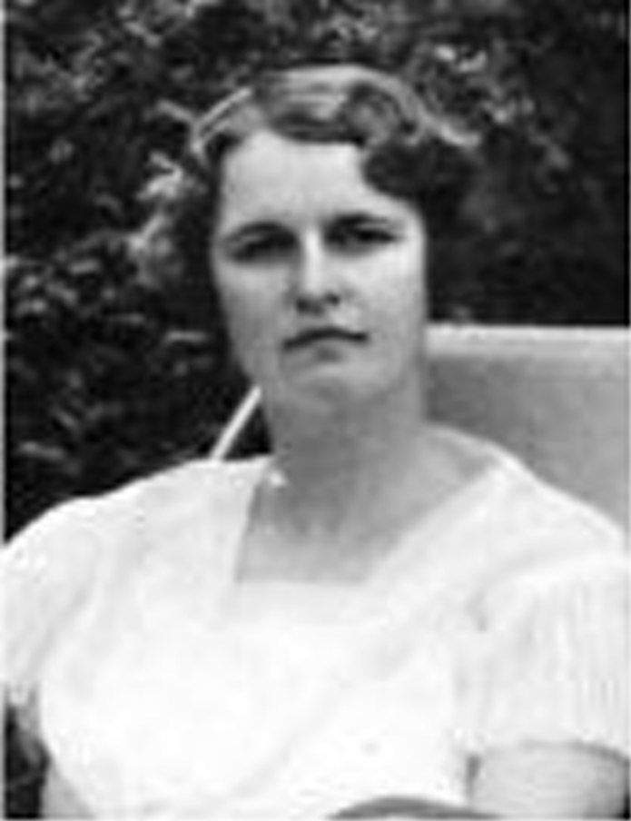

**1890 – 1983** | Founder of The Herb Society of America

Anne Bell Burrage co-founded and shaped The Herb Society of America, formally established on August 23, 1933, at her home in Ipswich, Massachusetts. Born into a prominent Boston family, she gathered six fellow gardeners and horticulturists to form a society dedicated to the study and research of herbs. From this small gathering grew a national institution whose mission has endured for nearly a century, promoting botanical knowledge and horticultural education.

**Links & References:**
* <https://www.herbsociety.org/about/history.html> — Official Herb Society history
* <https://www.herbsociety.org/> — The Herb Society of America

## David Fulton ~ Maternal great-great-great-grandfather

**1771 – 1843** | Irish-American pioneer, civic leader, and family patriarch

Born in 1771, David Fulton was an Irish-American settler remembered as a civic leader and the patriarch of a family line that would extend into American public life across later generations. Detailed records of his life are still being gathered; this entry is a placeholder pending further genealogical research.

**Links & References:**
* _Research in progress — see family records and genealogy archives._

## Erastus Foote ~ Paternal great-great-great-grandfather

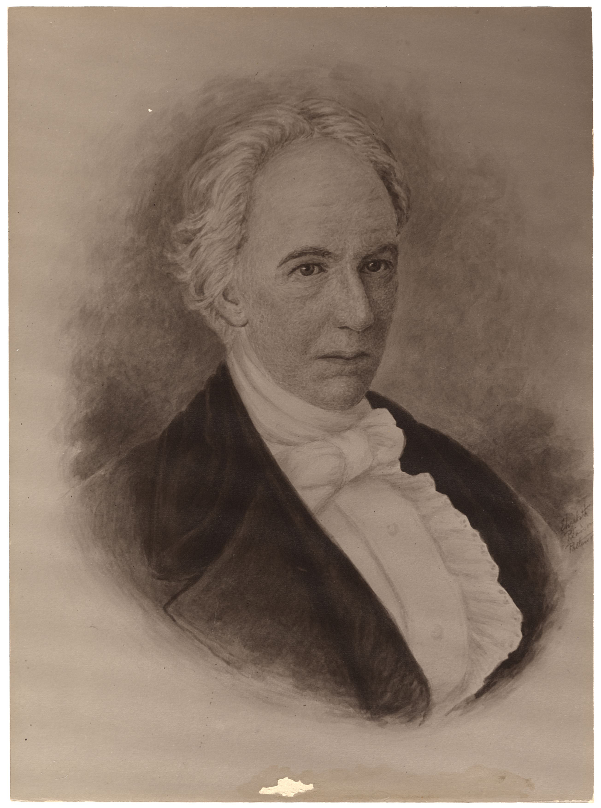

**1777 – 1856** | American lawyer and first Attorney General of Maine

Born September 19, 1777, in Waterbury, Connecticut, Erastus Foote was admitted to the bar in 1800 and built his law practice in Camden, Maine, then still part of Massachusetts. He served as County Attorney of Lincoln County and held the rank of Colonel in the Massachusetts militia during the War of 1812. A Jeffersonian (Democratic-)Republican, he was elected to the Massachusetts Senate in 1812 and later the Massachusetts House. After Maine achieved statehood in 1820, Governor William King appointed him the new state's first Attorney General — an office he held, through three appointments, until 1831. He returned to public service in the Maine House of Representatives in 1840 and died July 14, 1856, in Wiscasset, Maine, at age 78.

**Links & References:**
* <https://en.wikipedia.org/wiki/Erastus_Foote>
* [Maine's First Leaders](https://digitalmaine.com/arc_200_exhibit_first_leaders/1/)
* [Find a Grave memorial](https://www.findagrave.com/memorial/36411786/erastus-foote)

## Fyodor Trepov (senior) ~ Paternal great-great-grandfather

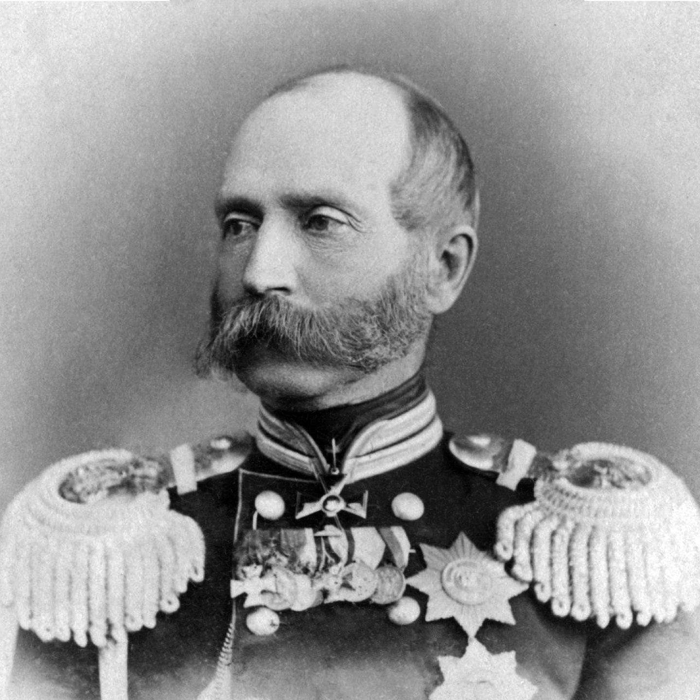

**1809 – 1889** | Russian general and Governor of Saint Petersburg

Fyodor Fyodorovich Trepov began his military career in 1831, helping suppress the November Uprising in Poland, and later commanded a regiment of gendarmes in Kiev. After Dmitry Karakozov's 1866 assassination attempt on Tsar Alexander II, Trepov was appointed chief of Saint Petersburg's police force, where he restored order and reformed the force, rising to adjutant general in 1867. He served as Governor (Lord Mayor) of Saint Petersburg from 1873 to 1878. In 1878 the revolutionary Vera Zasulich shot and wounded him after he ordered the flogging of a political prisoner; Trepov survived the much-publicized attack and retired with the rank of cavalry general. He was the father of Alexander Trepov (also in this list) and the patriarch of a prominent family of imperial officials.

**Links & References:**
* <https://en.wikipedia.org/wiki/Fyodor_Trepov_(senior)>

## George Armour ~ Paternal great-great-grandfather

**1812 – 1881** | Scottish American grain pioneer and art patron

Born in Campbeltown, Scotland, George Armour emigrated to America and revolutionized commodity distribution through his invention of mechanized grain elevator systems. Operating from Chicago, he was instrumental in establishing the Chicago Board of Trade's standardized grading system for grains (1858), which transformed global grain commerce. He served as president of the Chicago Board of Trade (1875–1876) and was a founder of the Merchants' Loan and Trust Company, which later became Continental Illinois. Beyond business, Armour was a passionate arts patron who served as the first president of the Chicago Academy of Fine Arts (1879), the precursor to the Art Institute of Chicago. He also founded the YMCA of Chicago and was an active elder of the Second Presbyterian Church, whose tower was donated by his family in his memory.

**Links & References:**
* <https://en.wikipedia.org/wiki/George_Armour>
* <https://www.artic.edu/> — Art Institute of Chicago (founded with Armour as first president)
* <https://www.ymcachicago.org/> — YMCA of Metro Chicago

## James Whitehill Shirk ~ Maternal great-great-grandfather

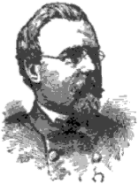

**1832 – 1873** | Union Navy commander in the American Civil War

Born in Pennsylvania on July 16, 1832, James Whitehill Shirk was appointed a midshipman in the U.S. Navy at age 16 in 1849, cruising the coasts of Africa, East India, and North America aboard the gunnery ship USS Plymouth over the following decade. He won distinction during the American Civil War serving in the Mississippi Squadron — notably at the Battle of Fort Henry (February 1862) and at Pittsburgh Landing, where his ship USS Lexington, alongside USS Tyler, prevented Confederate forces from crossing the river and helped save the Union Army from defeat at the Battle of Shiloh. He went on to fight at Chickasaw Bayou, St. Charles, and Arkansas Post, and commanded the Seventh Division of the Mississippi Squadron in 1863–1864. After the war he cruised with the European Squadron before his death in Washington, D.C., on February 10, 1873. The destroyer USS Shirk (DD-318) was later named in his honor.

**Links & References:**
* <https://en.wikipedia.org/wiki/USS_Shirk> — Namesake biography
* [Dictionary of American Naval Fighting Ships](https://www.history.navy.mil/content/history/nhhc/research/histories/ship-histories/danfs/s/shirk.html)

## Nikolay Danilovich Kudashev

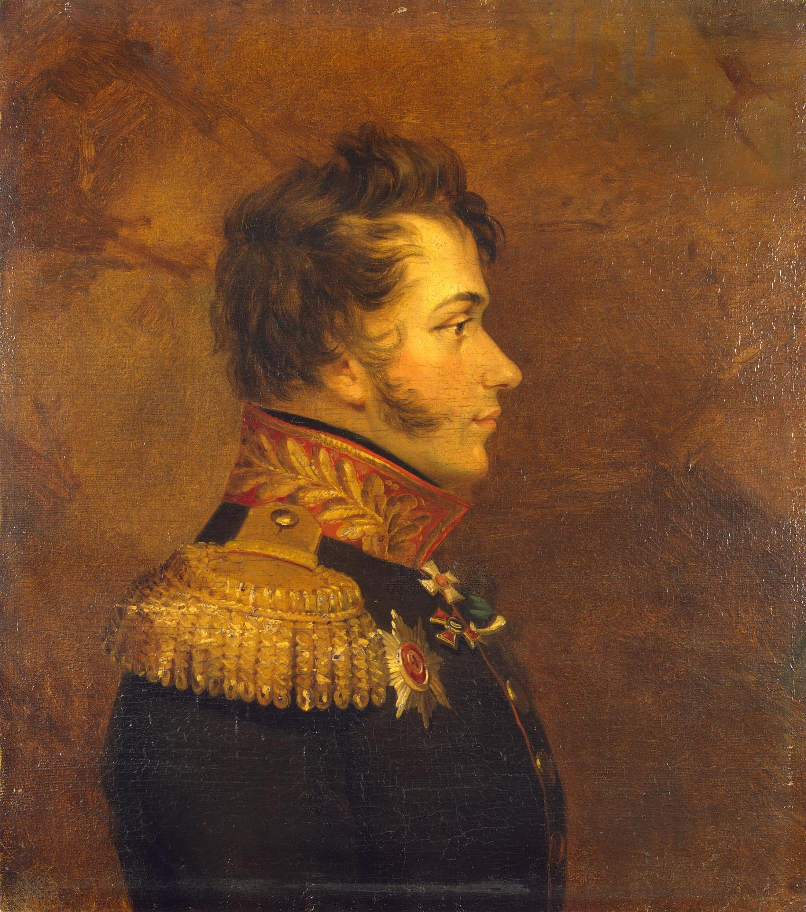

**1784 – 1813** | Russian Major General of the Napoleonic Wars

Prince Nikolay Danilovich Kudashev came from a Tatar noble family and entered military service in 1801. He fought in the campaign of 1805 and the Russo-Swedish War of 1808–1809, earning a reputation for conspicuous bravery, and was promoted to colonel in 1811. In 1812 he served on the staff of his father-in-law, Field Marshal Mikhail Kutuzov; fought at the Battle of Borodino; and commanded an army partisan detachment that harassed Napoleon's forces around Moscow and during the French retreat, distinguishing himself at the Battle of Krasnoi. Promoted to major general and awarded the Order of St. George (3rd class) in 1813, he was mortally wounded at the Battle of Leipzig — the "Battle of the Nations" — and died on November 9, 1813. His portrait hangs in the Military Gallery of the Winter Palace at the Hermitage in Saint Petersburg.

**Links & References:**
* <https://ru.wikipedia.org/wiki/%D0%9A%D1%83%D0%B4%D0%B0%D1%88%D0%B5%D0%B2,_%D0%9D%D0%B8%D0%BA%D0%BE%D0%BB%D0%B0%D0%B9_%D0%94%D0%B0%D0%BD%D0%B8%D0%BB%D0%BE%D0%B2%D0%B8%D1%87> — Russian Wikipedia
* [Military Gallery of the Winter Palace portrait](http://www.museum.ru/1812/persons/vgzd/vg_k49.html)

## Norman Armour ~ Paternal grandfather

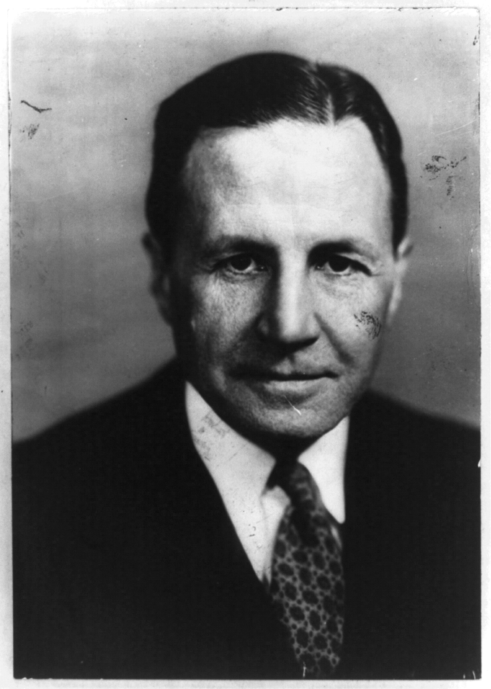

**1887 – 1982** | Career diplomat and Assistant Secretary of State

A distinguished career diplomat whom the New York Times called "the perfect diplomat," Norman Armour served as Chief of Mission in eight countries across a career spanning both World Wars. He served as U.S. Ambassador to Haiti (1932–1935), where he negotiated the withdrawal of American Marines following a 25-year occupation; to Canada (1935–1939); to Chile and Argentina during the WWII era; and to Spain, Venezuela, and Guatemala. He also served as Assistant Secretary of State for Political Affairs under Secretary of State George C. Marshall and famously protested Senator Joseph McCarthy's attacks on Foreign Service personnel suspected of communist sympathies. Born in Brighton, England, he earned degrees from Princeton University and Harvard Law School, spoke fluent French, and lived to age 94.

**Links & References:**
* <https://en.wikipedia.org/wiki/Norman_Armour>
* [Norman Armour Papers](http://arks.princeton.edu/ark:/88435/n870zq81v) — Seeley G. Mudd Manuscript Library, Princeton University

## Theodor von Nieroth ~ Paternal great-great-great-uncle

**1871 – 1952** | Major General in the Imperial Russian Army

Born July 2, 1871, in Saint Petersburg into the Baltic German von Nieroth family, Theodor was the son of the courtier Maximilian von Nieroth and Anastasia Trepova — a grandson of Fyodor Trepov (senior). After graduating from the elite Page Corps in 1892, he served in a Guards cavalry regiment, was promoted to colonel in 1907, and commanded the 16th Hussar Regiment (1911) and then the Life Guards Dragoon Regiment (1912), leading the latter through the First World War. In January 1915 he was awarded the Sword of St. George for repelling an enemy cavalry brigade near Schirwindt in East Prussia, where he was wounded but stayed in the field; he went on to command the 2nd Guards Cavalry Division. During the Russian Civil War he served in Anton Denikin's White Volunteer Army before emigrating, and died in France on March 26, 1952.

Theo Armour says: "My nickname comes from my uncle Theo."

**Links & References:**
* <https://et.wikipedia.org/wiki/Theodor_von_Nieroth_(1871%E2%80%931952)> — Estonian Wikipedia
* <https://www.ra.ee/apps/georgi/html/mitte-eestlaste_elulood.html>

## Walter Lowrie ~ Paternal great-uncle

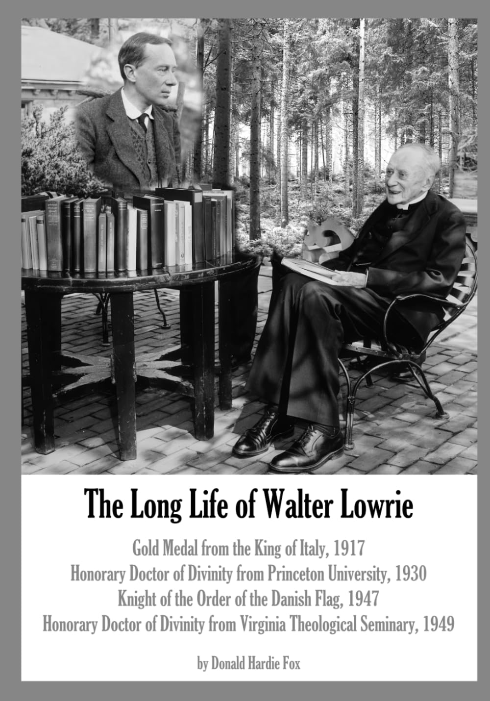

**1868 – 1959** | Kierkegaardian theologian and prolific translator

An Episcopal priest and scholar of extraordinary depth, Walter Lowrie devoted his career to translating and interpreting the works of Danish philosopher Søren Kierkegaard for the English-speaking world. After graduating from Princeton University and studying in Europe, he served as rector of St. Paul's American Church in Rome (1907–1930), then began his "itinerant ministry" publishing 39 books and numerous scholarly articles. From 1939–1945, he published twelve volumes of Kierkegaard translations in collaboration with fellow scholar David F. Swenson. His contributions to Kierkegaard scholarship were so significant that Denmark awarded him the Knight Cross of the Order of Dannebrog in 1947 "as an appreciation of his extensive efforts to spread the knowledge of the intellectual production of Søren Kierkegaard in the Anglo-Saxon world."

**Links & References:**
* <https://en.wikipedia.org/wiki/Walter_Lowrie_(author)>
* <https://www.goodreads.com/author/list/264525.Walter_Lowrie> — Complete bibliography of published works
* [Walter Lowrie House, Princeton](https://etcweb.princeton.edu/CampusWWW/Companion/lowrie_house.html) — Now part of Princeton University

## William S. Fulton ~ Maternal great-great-great-grandfather

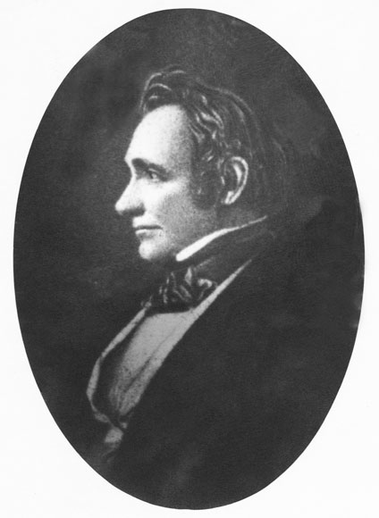

**1795 – 1844** | Governor of Arkansas Territory and U.S. Senator

Connected to the family through Ida Watkins (maternal great-grandmother), William Savin Fulton was born June 2, 1795, in Cecil County, Maryland, and graduated from Baltimore College in 1813. With the outbreak of the War of 1812 he enlisted at Fort McHenry and took part in the Battle of Baltimore, and in 1818 served as military secretary to General Andrew Jackson during the Seminole War. Admitted to the bar in Tennessee in 1817, he later settled in Alabama and won election to its legislature. President Jackson appointed him Secretary of the Arkansas Territory in 1829 and then Governor of the Territory in 1835. When Arkansas achieved statehood in 1836, Fulton became one of its first U.S. Senators, serving as a Jacksonian Democrat until his death at his Little Rock home on August 15, 1844. Fulton County, Arkansas, is named in his honor.

**Links & References:**
* <https://en.wikipedia.org/wiki/William_S._Fulton>
* [Encyclopedia of Arkansas](https://encyclopediaofarkansas.net/entries/william-savin-fulton-2653/)
* [Biographical Directory of the U.S. Congress](https://bioguide.congress.gov/search/bio/F000425)
