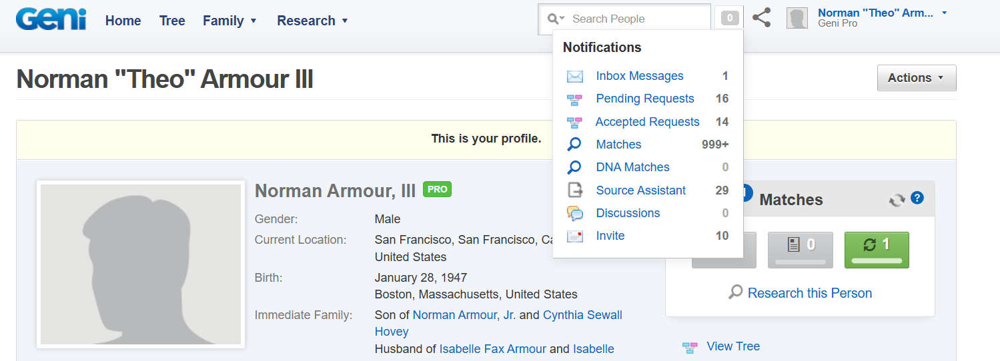

# 2025-12-14 Jeff Carley - Next Steps

Hi Jeff

## Goals

* First pass: map or list or catalog the blood relatives in my family
* Second pass: Verify of double check the first pass results
* Third pass: Identify the persons of deep interest and research them more thoroughly

## Current State

With over 15,000 entries in Genie, the first pass contains more than enough data necessary to get to the third pass.

* In Genie, click on "Tree," load a tree and click on "Statistics" to view the amazing numbers.
* In comparison Ancestry only has just 450 entries in the Armour-Ferté tree.

My observation is that the first pass is about quantity, the second pass is about quality, and the third pass is about depth. Geni is far superior to Ancestry for the first pass because of its collaborative nature.

Given the collaborative nature of Geni, it is worth paying respect to the  people who have helped create this collaboration.

## Responding to Notifications

Click On the Notifications icon next to the Search box at the top, you'll see the following menu.

My I propose that your next task would be to deal with all the pending requests and verify that all Pending Requests and Invites have actually been dealt with.

There are way too many Matches items to deal with for now, but when you go to the Matches tab, You will see that there are just a few requested merges, tree conflicts, and data conflicts. Perhaps you may have time to look at those as well.

I hope this task might be of interest to you. Please do ask me any questions You may have in order to achieve the task. Please get any clarifications before jumping in and starting a new job
