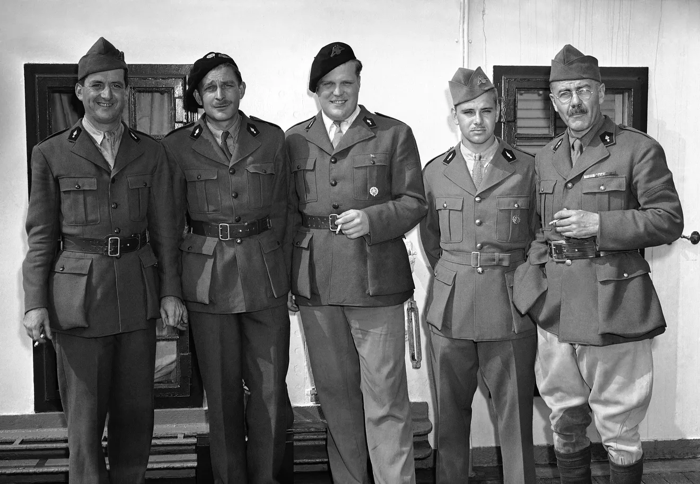

Albert Cameron Burrrage III

https://www.metrowestdailynews.com/picture-gallery/entertainment/2020/07/16/photos-today-in-history-july/66197863007/

As they arrived aboard the liner Manhattan in New York on July 18, 1940 from the European war zone are these ambulance drivers: (left to right): Charles L. Safford of Lowell, Mass., Peter Jackson of Fletcher, N.C., King Stone, society sportsman of Warrenton, Va., Albert C. Burrage III of Boston and H. Smith of Millbrook, N.Y. The Manhattan carried 798 passengers, all but 116 of them U.S. citizens fleeing from France. (AP Photo)

MetroWest Daily News
