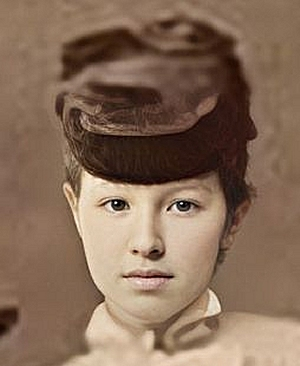

# Anastasia Fyodorovna Trepova (1849–1940) ~ Анастасия Фёдоровна Трепова

## Genealogy

* Birth: May 15 1849 - Kiev, Ukraine
* Death: Sep 25 1940 - Amblainville, Oise, Nord-Pas-de-Calais-Picardie, France
* Father: [Fyodor Fyodorovich Trepov Sr.](Fyodor-Fyodorovich-Trepov-1812-1889.md)
* Mother: Vera Vasilyevna Lukashevich (married Trepov)
* Husband: [Maximilian Carl Benedict von Nieroth](Maximilian-Carl-Benedict-von-Nieroth-1846-1914.md) (born Nieroth)
* Children: [Fyodor Maximilianovich von Nieroth](Fyodor-Maximilianovich-von-Nieroth-1871-1952.md), [Vera Maximilianovna von Nieroth](Vera-Maximilianovna-von-Nieroth-1874-1920.md) (married Kudashev)
* Siblings: Yevgeniya Fyodorovna Trepova (married Albertov), Sofya Fyodorovna Trepova (married Nieroth), Fyodor Fyodorovich Jr. Trepov, [Alexander Fyodorovich Trepov](Alexander-Fyodorovich-Trepov-1862-1928.md), Yuliya Fyodorovna Trepova (married Sukhodolsky), Dmitri Fyodorovich Trepov, Yelizaveta Fyodorovna Trepova (married Mosolov), Vladimir Fyodorovich Trepov

## Names and Spellings

* Russian: Анастасия Фёдоровна Нирод (Трепова)
* Finnish: Anastasia Fjodorovna Nieroth (Trepova)
* Modern transliteration: Anastasiya Fyodorovna Nirod (née Trepova)
* Also seen as: Anastatisya ~ Geni spelling, used for this folder and file
* Note: Нирод (Nirod) is the Russian form of the Baltic German name von Nieroth
