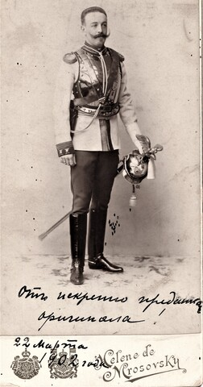

# Fyodor Maximilianovich von Nieroth (1871–1952) ~ Фёдор Максимилианович Нирод

| `theodor-nieroth.jpeg` | Fyodor Maximilianovich von Nieroth (1871–1952) | [Wikimedia Commons](https://commons.wikimedia.org/wiki/File:Fyodor_M._Nirod.jpeg)

## Genealogy

* https://www.geni.com/people/Count-Fyodor-von-Nieroth/6000000019324085685
* Count Fyodor Maximilianovich von Nieroth
* Birth:  June 20 1871 - St. Petersburg, Russia
* Death:  1952 - Amblainville, Picardie, France
* Parents:  Count [Maximilian Carl Benedict von Nieroth](Maximilian-Carl-Benedict-von-Nieroth-1846-1914.md) and [Anastasia Fyodorovna Trepova](Anastasia-Fyodorovna-Trepova-1849-1940.md) (married Nieroth)
* Sister:  [Vera Maximilianovna](Vera-Maximilianovna-von-Nieroth-1874-1920.md)
* Partner:  Daria Nieroth (born Fstin. Cantacuzin Gfin. Speransky)
* Children:  Mikhail Fyodorovich and Daria

## Names and Spellings

* Russian: Фёдор Максимилианович Нирод ~ verify
* German: Theodor von Nieroth ~ Baltic German family name; Estonian Wikipedia uses this form
* Modern transliteration: Fyodor Maksimilianovich Nirod
* Note: Theodor is the German equivalent of Fyodor

## Links

* <https://ru.wikipedia.org/wiki/%D0%9D%D0%B8%D1%80%D0%BE%D0%B4,_%D0%A4%D1%91%D0%B4%D0%BE%D1%80_%D0%9C%D0%B0%D0%BA%D1%81%D0%B8%D0%BC%D0%B8%D0%BB%D0%B8%D0%B0%D0%BD%D0%BE%D0%B2%D0%B8%D1%87>
* <https://et.wikipedia.org/wiki/Theodor_von_Nieroth_(1871%E2%80%931952)> — Estonian Wikipedia
* <https://www.ra.ee/apps/georgi/html/mitte-eestlaste_elulood.html>
* <https://www.ria1914.info/index.php/%D0%9D%D0%B8%D1%80%D0%BE%D0%B4_%D0%A4%D0%B5%D0%B4%D0%BE%D1%80_%D0%9C%D0%B0%D0%BA%D1%81%D0%B8%D0%BC%D0%B8%D0%BB%D0%B8%D0%B0%D0%BD%D0%BE%D0%B2%D0%B8%D1%87>
* <https://commons.wikimedia.org/w/index.php?search=trepov>

## Life

**1871 – 1952** | Major General in the Imperial Russian Army

From Claude?

Born July 2, 1871, in Saint Petersburg into the Baltic German von Nieroth family, Fyodor was the son of the courtier Maximilian von Nieroth and Anastasia Trepova — a grandson of Fyodor Trepov (senior). After graduating from the elite Page Corps in 1892, he served in a Guards cavalry regiment, was promoted to colonel in 1907, and commanded the 16th Hussar Regiment (1911) and then the Life Guards Dragoon Regiment (1912), leading the latter through the First World War. In January 1915 he was awarded the Sword of St. George for repelling an enemy cavalry brigade near Schirwindt in East Prussia, where he was wounded but stayed in the field; he went on to command the 2nd Guards Cavalry Division. During the Russian Civil War he served in Anton Denikin's White Volunteer Army before emigrating, and died in France on March 26, 1952.

## Sandricourt

This is the chateau where Uncle Theo was living when I met him in 1969. He was the game-keeper. It is located in the Oise department of France, about 50 miles north of Paris.

* https://maps.app.goo.gl/H5u86RCxDhKYx5xL9
* https://americanaristocracy.com/houses/chateau-de-sandricourt
* https://www.nytimes.com/1908/09/20/archives/r-goelet-buys-a-chateau-pays-300000-for-sandricourt-may-be-for-his.html
* https://sandricourtshoot.com/en/

## Estonia Wikipedia

https://et.wikipedia.org/wiki/Theodor_von_Nieroth_(1871%E2%80%931952)

Theodor von Nieroth (2 July 1871 – 26 March 1952) was a military officer of the Russian Empire. During the Russian Civil War, he fought in the Volunteer Army.

### Biography
Theodor von Nieroth was descended from the Nieroth family. He was born the son of courtier Maximilian von Nieroth (1846–1914) and Anastasia Trepova (born 1849). [1]

Theodor von Nieroth entered military service at a young age. After graduating from the Paažikorpus (1892), he served in the Guards Cavalry Regiment[2].

In 1907, Theodor von Nieroth was promoted to colonel[2].

In 1911 he was appointed to the 16th Hussar Regiment and in 1912. Bodyguard Dragoon Regiment. He also served in this position during World War I. From January 1915 he was the commander of the 2nd Brigade of the 2nd Cavalry Division of the Guards Cavalry Division[2].

Theodor von Nieroth took part in the Russian Civil War as part of the White Guard Volunteer Army led by Anton Denikin[2].

Theodor von Nieroth died on 26 March 1952 in France.

### Awards

On 10 January 1915, Theodor von Nieroth was awarded the Sword of George.

"In a battle on 01.08.1914 near Schirwindt in East Prussia, the enemy cavalry brigade repelled the attack of the enemy's cavalry brigade with its regiment and guard artillery battery. Nieroth was wounded in this battle, but remained in the line."

### Family
Theodor von Nieroth married in 1897. in St. Petersburg Daria, Princess Cantacuzène, with Countess Speransky, who was the daughter of Mikhail Rodionovich, Prince Cantacuzène, Count Speransky (1848–1894) and Elisabeth Sicard. The marriage produced:[1]

* Mihhail von Nieroth (born 1899)
Daria von Nieroth (born 1900)

## My Comments

Theo Armour says: "My nickname comes from my uncle Theo."

