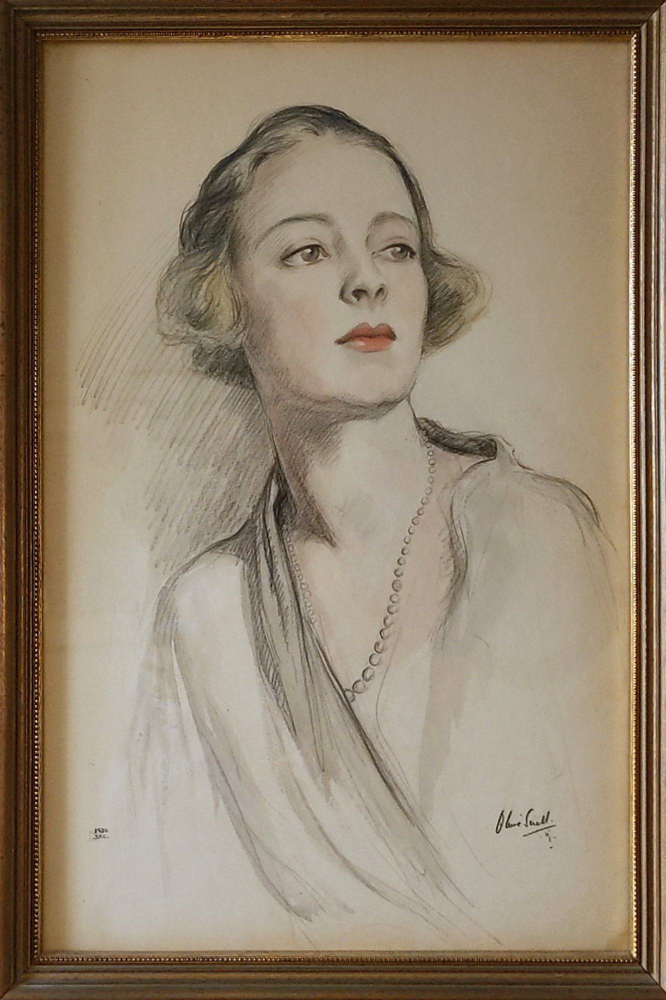

# Maria Sergeyevna Kudasheva (1896–1990) ~ Мария Сергеевна Кудашева

https://evereverland.github.io/2019/everlandings/theo-armour/armour-fine-art/1921-olive-snell-myra-koudachev-armour.jpg

## Genealogy

* https://www.geni.com/people/Princess-Myra-Armour/364408351200007646
* Princess Maria Sergeyevna Kudasheva (married Armour)
* Birth:  Apr 7 1896 - Saint Petersburg, Russia
* Death:  Sep 15 1990 - New York, New York, United States
* Parents:  Prince [Sergei Vladimirovich Kudashev](Sergei-Vladimirovich-Kudashev-1863-1933.md) and Countess [Vera Maximilianovna von Nieroth](Vera-Maximilianovna-von-Nieroth-1874-1920.md) (married Kudashev)
* Siblings:  [Sergei Sergeyevich](Sergei-Sergeyevich-Kudashev-1901-1991.md) and Olga
* Partner:  The Honorable [Norman Armour, Sr](Norman-Armour-Sr-1887-1982.md)
* Son:  [Norman](Norman-Armour-Jr-1920-1978.md)

## Names and Spellings

* Russian: Мария Сергеевна Кудашева ~ verify
* Modern transliteration: Maria Sergeyevna Kudasheva
* French transliteration: Myra Sergéievna Koudacheff ~ as used in émigré documents
* Also seen as: Koudachev ~ Geni; Koudacheff ~ Sweden-era documents
* Married name: Myra Armour
* Known as: Myra; "Granny"

## My Comments

I loved my grandmother and had excellent communication with her. Nonetheless, I know very little about my grandmother's youth. I know she spoke seven languages quite fluently. I remember her reminiscing that she had her debutante "coming out party" with one of the Tsarina's daughters, but I don't know which one.

After my grandmother left Russia and married my grandfather, she apparently devoted her life to his career and to being a good American.

As far as I know, my father spoke little or no Russian. Apart from family members, as far as I know, she had few Russian friends.
