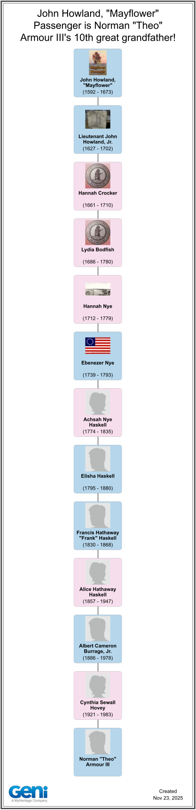

# Norman "Theo" Armour III (1947–)

* Known as: Theo

## Genealogy

* https://www.geni.com/family-tree/index/6000000004118029730
* Birth: 1947 ~ add full date and place
* Parents: [Norman Armour Jr](../Norman-Armour-Jr-1920-1978/Norman-Armour-Jr-1920-1978.md) and [Cynthia Sewall Burrage](../Cynthia-Burrage-Hovey-1921-1983/Cynthia-Burrage-Hovey-1921-1983.md) (later married Hovey)
* Paternal grandparents: [Norman Armour Sr](../Norman-Armour-Sr-1887-1982/Norman-Armour-Sr-1887-1982.md) and Princess [Maria Sergeyevna Kudasheva](../Maria-Sergeyevna-Kudasheva-1896-1990/Maria-Sergeyevna-Kudasheva-1896-1990.md)
* Maternal grandparents: [Albert Cameron Burrage Jr](../Albert-Cameron-Burrage-Jr-1886-1978/Albert-Cameron-Burrage-Jr-1886-1978.md) and [Anne Bell Shirk](../Anne-Bell-Burrage-1890-1983/Anne-Bell-Burrage-1890-1983.md)
* Siblings: `<Private>` and `<Private>`
* Children: three daughters ~ `<Private>`, `<Private>` and `<Private>`

### Mayflower Descent

| `Norman-Theo-Armour-III-John-Howland-Mayflower-Passenger.png` | John Howland, Mayflower passenger, is Theo's 10th great-grandfather ~ thirteen generations via the Nye, Haskell and Burrage lines | [Geni](https://www.geni.com/family-tree/index/6000000004118029730) chart, created 2025-11-23 |

Line of descent:

1. John Howland, "Mayflower" (1592–1673)
2. Lieutenant John Howland, Jr. (1627–1702)
3. Hannah Crocker (1661–1710)
4. Lydia Bodfish (1686–1780)
5. Hannah Nye (1712–1779)
6. Ebenezer Nye (1739–1793)
7. Achsah Nye Haskell (1774–1835)
8. [Elisha Haskell](../Elisha-Haskell-Jr-1795-1880/Elisha-Haskell-Jr-1795-1880.md) (1795–1880)
9. [Francis Hathaway "Frank" Haskell](../Francis-Hathaway-Haskell-1830-1868/Francis-Hathaway-Haskell-1830-1868.md) (1830–1868)
10. [Alice Hathaway Haskell](../Alice-Hathaway-Haskell-Burrage-1861-1947/Alice-Hathaway-Haskell-Burrage-1861-1947.md) (1857–1947)
11. [Albert Cameron Burrage, Jr.](../Albert-Cameron-Burrage-Jr-1886-1978/Albert-Cameron-Burrage-Jr-1886-1978.md) (1886–1978)
12. [Cynthia Sewall Hovey](../Cynthia-Burrage-Hovey-1921-1983/Cynthia-Burrage-Hovey-1921-1983.md) (1921–1983)
13. Norman "Theo" Armour III

## Names and Spellings

* Full name: Norman Theo Armour III
* Known as: Theo
* The third Norman Armour, after grandfather [Norman Armour Sr](../Norman-Armour-Sr-1887-1982/Norman-Armour-Sr-1887-1982.md) and father [Norman Armour Jr](../Norman-Armour-Jr-1920-1978/Norman-Armour-Jr-1920-1978.md)

## Life

In his own words (from notes written 2023):

* 1980s ~ helped China industrialize
* 1990s ~ helped the world transition from paper to digital
* 2000s ~ helped the world transition from 2D to 3D ~ a pioneer in the field of 3D on the web
* Father of three engaged, productive and happy daughters
* Currently: secretary of his residents association, editor of its monthly newsletter, mentor to younger people with their startups

## Residences

* Marina District, San Francisco ~ current ~ verify
* ~ add earlier residences: childhood homes, and where the 1980s–2000s chapters happened

## Works

* https://github.com/theo-armour ~ open-source projects
* This genealogy ~ [site](https://theo-armour.github.io/genealogy/) and [repository](https://github.com/theo-armour/genealogy)
* TooToo ~ single-file GitHub repo viewer used across his projects
* [Ladybug Tools](https://www.ladybug.tools/) ~ consultant and software developer
* EverEverLand ~ startup, work in progress

## Links

* <https://pewu.github.io/topola-viewer/#/view?url=https://theo-armour.github.io/genealogy/Online-Genealogy/gedcom-files/2025-08-18-export-geni/export-BloodTree.ged> ~ interactive blood-line tree
* https://www.geni.com/family-tree/index/6000000004118029730

## Research Notes

### 2026-08-07 ~ Page filled in

* Genealogy drawn from the Geni Mayflower chart (created 2025-11-23) and the linked family pages; Life and Works from Theo's own notes
* Living family members marked `<Private>` per wiki convention ~ Theo may name them if he wishes
* Discrepancy to resolve: the Alice Hathaway Haskell folder is dated 1861–1947 but her page title and the Geni chart both say 1857–1947

## My Comments
