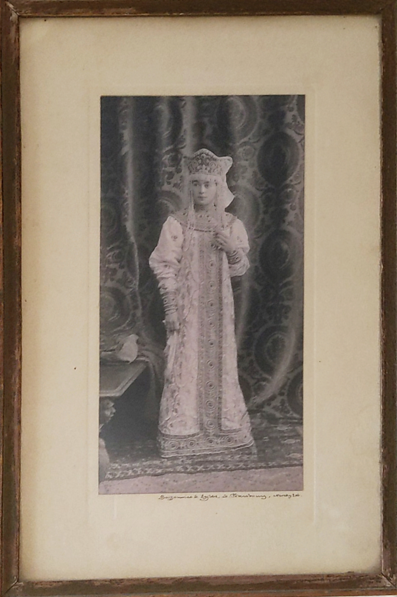
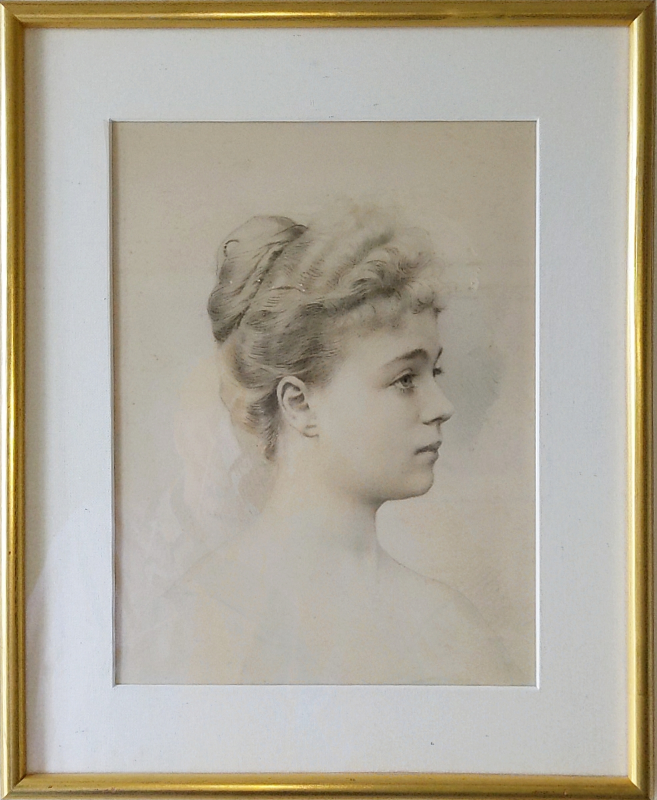

# Countess Vera Maximilianovna von Nieroth (1874–1920) ~ Вера Максимилиановна Нирод

## Genealogy

* https://www.geni.com/people/Princess-Vera-Kudasheva/6000000019323779328
* Countess Vera Maximilianovna von Nieroth (married Kudashev)
* Birth:  July 23 1874 - St. Petersburg
* Death:  Jan 26 1920 - Paris
* Parents:  Count [Maximilian Carl Benedict von Nieroth](Maximilian-Carl-Benedict-von-Nieroth-1846-1914.md) and [Anastasia Fyodorovna Trepova](Anastasia-Fyodorovna-Trepova-1849-1940.md) (married Nieroth)
* Brother:  [Fyodor Maximilianovich](Fyodor-Maximilianovich-von-Nieroth-1871-1952.md)
* Partner:  Prince [Sergei Vladimirovich Kudashev](Sergei-Vladimirovich-Kudashev-1863-1933.md)
* Children:  [Maria Sergeyevna](Maria-Sergeyevna-Kudasheva-1896-1990.md) and [Sergei Sergeyevich](Sergei-Sergeyevich-Kudashev-1901-1991.md)

## Names and Spellings

* Russian: Вера Максимилиановна Кудашева (урождённая графиня фон Нирод) ~ verify
* Modern transliteration: Vera Maksimilianovna Kudasheva (née Countess von Nieroth)
* Also seen as: von Neiroth ~ misspelling in the evereverland image file names
* Maiden name: Countess Vera von Nieroth

## Links

* https://evereverland.github.io/2019/everlandings/theo-armour/armour-fine-art/1900~-unknown-vera-von-neiroth-in-court-dress.jpg
* https://evereverland.github.io/2019/everlandings/theo-armour/armour-fine-art/1900~-unknown-vera-von-neiroth.jpg
* https://www.kudashev.com/2007/10/portrait-of-moltedo-by-ingres.html

